<div align="center">

# Hi, I'm Eyad Saleh 👋

### Computer Science Senior @ KSIU | Cloud & Data Engineering Specialist


</div>

---

## 📍 About

I'm a Computer Science senior at KSIU with a strong focus on cloud infrastructure and data engineering. I specialize in building scalable data pipelines and designing robust cloud-native architectures.

```python
expertise = {
    "focus_areas": ["Data Engineering", "Cloud Architecture", "Distributed Systems"],
    "current_stack": ["PostgreSQL", "Docker", "Apache Kafka", "Python"],
    "cloud_platforms": ["AWS", "Azure"],
    "interests": ["ETL Pipelines", "Stream Processing", "Infrastructure as Code"]
}
```

**Currently:** Deepening expertise in PostgreSQL, Docker, Kafka, and modern data orchestration tools

**Goal:** Building production-grade data solutions and contributing to distributed systems architecture

---

## 🛠️ Technical Stack

<div align="center">

### Cloud & Infrastructure


### Data Engineering


### Tools & Technologies


</div>

---

## 📊 GitHub Statistics

<div align="center">
  
  
</div>

<div align="center">
  
</div>

---

## 🎯 Current Focus Areas

```mermaid
graph TD
    A[Data Engineering] --> B[Stream Processing]
    A --> C[Cloud Infrastructure]
    A --> D[Pipeline Orchestration]
    B --> E[Apache Kafka]
    C --> F[AWS & Azure]
    D --> G[Workflow Management]
    style A fill:#00D9FF,stroke:#00D9FF,color:#000
    style B fill:#1a1a2e,stroke:#00D9FF
    style C fill:#1a1a2e,stroke:#00D9FF
    style D fill:#1a1a2e,stroke:#00D9FF
```

<div align="center">



</div>

**Key Areas of Development:**
- Designing scalable data pipeline architectures
- Implementing real-time stream processing solutions
- Building cloud-native infrastructure with containerization
- Developing efficient ETL workflows and data transformation processes

---

## 📫 Connect

<div align="center">

[](https://www.linkedin.com/in/eyad-saleh-810a1a293/)
[](mailto:eiad222101239@ksiu.edu.eg)

**Open to opportunities in data engineering and cloud architecture roles**

</div>

---

<div align="center">


*Building robust data solutions, one pipeline at a time*

</div>
